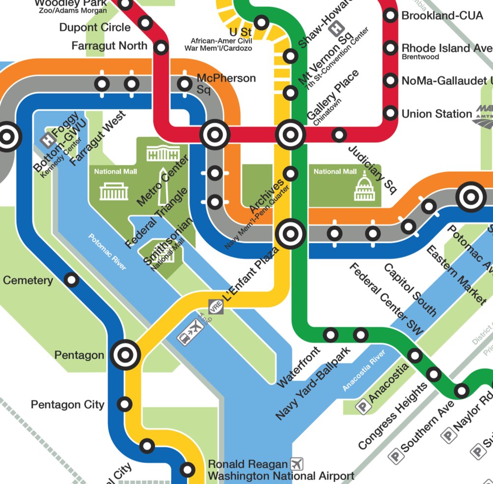

# Subway Router

This project is a ~train~ subway router that takes directories in **csv** format
and creates a map of them.  From there, the user can enter the current location
and their desired destination and the router will tell them what exits to take.



The above is an example map.  One of the included datasets, the Vienna dataset, was obtained [here](https://www.kaggle.com/lenapiter/vienna-subway-network).  

## Code Section
The following is a piece of the code from the router.  The main method reads
in names from the csv file, and puts them into this method, creating a
HashMap of to and from links.

```java
private void putInMap(String from,String to, String color) {
		ArrayList<Link> list;
		Link link = new Link(from,to,color);
		//If the key is already present
		if(map.containsKey(from)) {
			//Gets list already at that key
			list = map.get(from);
			//If the list does not contain the new 
			//destination, add it to the list
			if(!list.contains(link)) {
				list.add(link);
			}
		}
		//If the from is a new key
		else {
			list = new ArrayList<Link>();
			if(!list.contains(link)) {
				list.add(link);
			}
		}
		map.put(from, list);
	}


### Acknowledgements

Thanks to Louis Oliphant for hopefully grading me fairly well on this.
